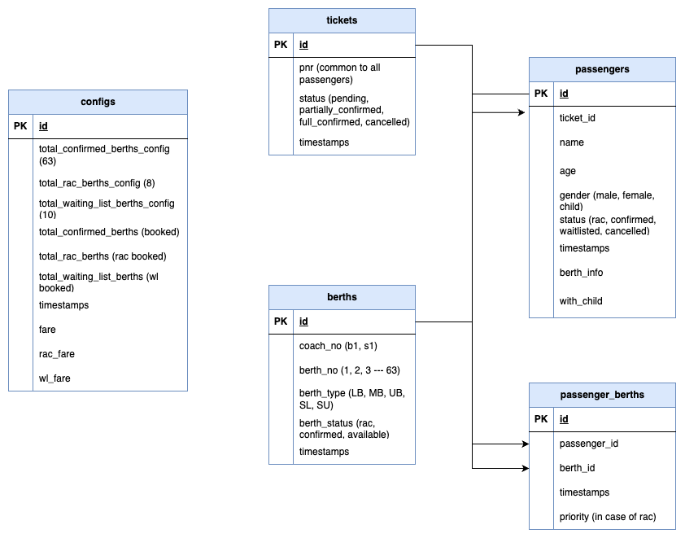

# 🚀 Railway Ticket Reservation API

Create a RESTful API that manages railway ticket reservations. 

- Video demonstration: https://drive.google.com/file/d/1TLa1zpd8LOZZFc9DICHn8eWZ2zyYGjZd/view?usp=sharing

## System Requirements
Ensure your system meets the following requirements before proceeding:

- **Node.js**: v21.2.0 or higher
- **npm/yarn**: Latest version
- **Express.js**: Node backend framework
- **Postgres**: for backend database

## Installation Instructions
In Github, client & server reside under the same directory, so just clone the parent one.
1. Clone the repository:
   ```bash
   git clone https://github.com/your-repo-url.git

2. Open project in any editor:
    ```bash
    cd repo

3. Install dependencies:
   ```bash
   npm install

4. Set up environment variables:
    - Copy ./env.example to ./.env
    - Update .env with appropriate values for your local setup.
    - Make sure, you add local psql creds & create db

5. Prisma ORM Setup:
   ```bash
   npx prisma generate
   npm run migrate

6. Start the backend server:
    ```bash
   npm run dev

Once server is started, if prisma initialisation, migration, db setup done correctly, we can able to see the log.

## DB Schema


## Postman Collection
The Postman collection for testing API endpoints is located at:

    ```bash
    frejun_collection.postman_collection.json

You can import this file into Postman to test all available API routes.

## How To Setup Configs?
Once collection is been imported, we have to setup our berths configs

### Berth Config Setup
Hit this API, it will setup default berth configs
   ```bash
   /api/v1/configs

# We are done, now we can use tickets api's